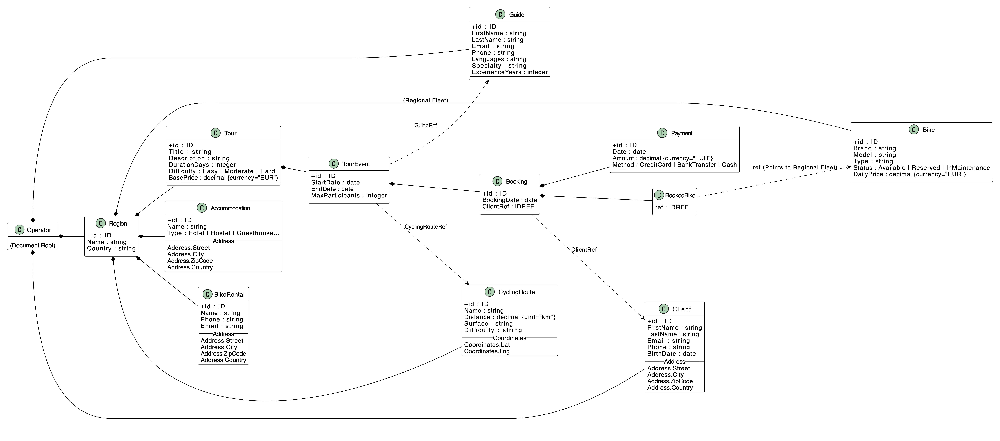

# DSTI Data Pipeline (XML Tour Operator)

## About the project
This project designs an XML-based data platform for a cycling tour operator. It models destinations, routes, bikes, activities, events, packages, bookings, clients, and guides, and showcases how XML technologies can power real tourism and logistics workflows. The deliverables cover:
- A modular XML Schema (`schemas/xml/operator.xsd`) and a representative XML database (`data/operator.xml`).
- User-oriented scenarios rendered via XSLT: 6 HTML/visualizations, 2 XML exports, and 2 JSON exports.
- Python tooling to validate the XML against the schema and to apply XSLT, plus a DOM-based reimplementation of one scenario without XSLT.




## Project structure
```
DSTI_data_pipeline
    ├── data
    │   └── operator.xml
    ├── docs
    │   └── data-model.png
    ├── outputs
    │   ├── bike_availability.html
    │   ├── bike_inventory.xml
    │   ├── bookings.json
    │   ├── clients_directory.html
    │   ├── events_calendar.html
    │   ├── guide_planning.html
    │   ├── invoice_dom.html
    │   ├── invoice.html
    │   ├── regions.json
    │   ├── tour_catalog.html
    │   └── tour_events_summary.xml
    ├── python
    │   ├── apply_xslt.py
    │   ├── invoice_dom.py
    │   └── validate_operator.py
    ├── schemas
    │   ├── json
    │   │   └── bookings_json_schema.json
    │   └── xml
    │       └── operator.xsd
    ├── xslt
    │   ├── html
    │   │   ├── bike_availability.xsl
    │   │   ├── clients_directory.xsl
    │   │   ├── events_calendar.xsl
    │   │   ├── guide_planning.xsl
    │   │   ├── invoice.xsl
    │   │   └── tour_catalog.xsl
    │   ├── json
    │   │   ├── bookings_json.xsl
    │   │   └── regions_json.xsl
    │   └── xml
    │       ├── bike_inventory_xml.xsl
    │       └── tour_events_summary.xsl
    ├── .gitignore
    ├── README.md
    └── requirements.txt
```
- `data/` — XML dataset for the operator (`operator.xml`).
- `schemas/xml/` — XML Schema definition (`operator.xsd`) with keys/refs for guides, clients, regions, routes, events, bookings.
- `schemas/json/` — JSON Schema used for the JSON booking export (`bookings_json_schema.json`).
- `xslt/html/` — HTML scenarios (catalogue, bike availability, client directory, guide planning, events calendar, invoices).
- `xslt/xml/` — XML exports (tour events summary, bike inventory).
- `xslt/json/` — JSON exports (regions overview, bookings).
- `python/` — Utilities: `apply_xslt.py`, `validate_operator.py`, `invoice_dom.py`.
- `outputs/` — Sample transformed outputs generated from `data/operator.xml`.
- `requirements.txt` — Python dependencies (lxml, xmlschema).
- `.gitignore` — Ignore rules.

## Scenarios implemented (XSLT)
- HTML: `tour_catalog.xsl`, `bike_availability.xsl`, `clients_directory.xsl`, `guide_planning.xsl`, `events_calendar.xsl`, `invoice.xsl`.
- XML: `tour_events_summary.xsl`, `bike_inventory_xml.xsl`.
- JSON: `regions_json.xsl`, `bookings_json.xsl`.
- DOM (no XSLT): `python/invoice_dom.py` rewrites the invoice scenario using Python’s `xml.dom`.

## Installation
Clone the repo and move into it:
```bash
git clone https://github.com/Lucky12348/DSTI_data_pipeline.git
cd DSTI_data_pipeline
```

### Option 1 — Conda
```bash
conda create -n dsti-xml python=3.11 -y
conda activate dsti-xml
pip install -r requirements.txt
```

### Option 2 — pip + virtualenv (Windows & Linux)

### Windows :
```cmd
python -m venv .venv
.venv\Scripts\activate
pip install -r requirements.txt
```

### Linux
```bash
python3 -m venv .venv
source .venv/bin/activate
pip install -r requirements.txt
```

## Start the project (commands to run)
- Validate XML against XSD:
```bash
python python/validate_operator.py
```
- Apply any XSLT to the dataset (HTML/XML/JSON outputs):
```bash
python python/apply_xslt.py data/operator.xml xslt/html/tour_catalog.xsl outputs/tour_catalog.html
```
- DOM-based invoice (second implementation without XSLT):
```bash
python python/invoice_dom.py --xml data/operator.xml --out outputs/invoice_dom.html
```

Generated files land in `outputs/`. Open HTML in a browser; JSON/XML can be inspected directly.

# Contributors
Thanks to [BenjaminUzandotio](https://github.com/BenjaminUzandotio), [OmarOsta](https://github.com/OmarOsta), [MohammedBenrohou](), [Lucky12348](https://github.com/Lucky12348) for their valuable contributions to this project.